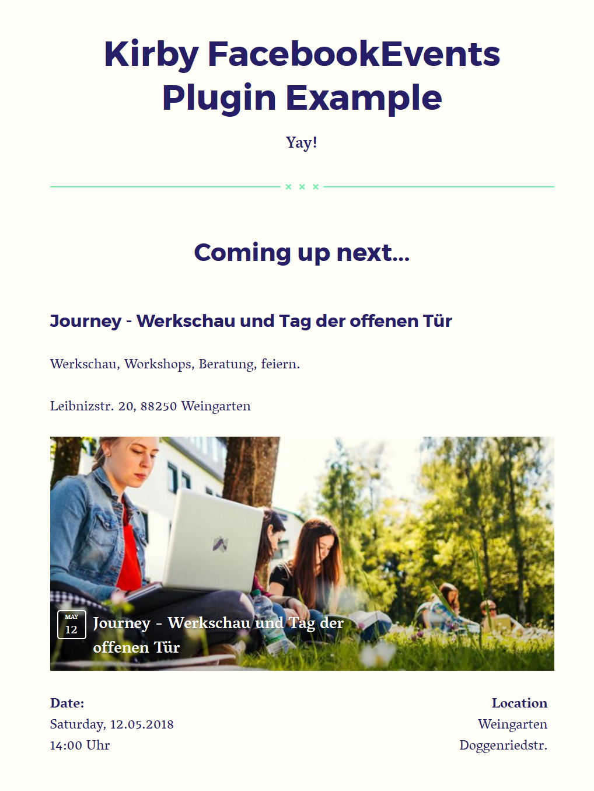

# Kirby Facebook-Events Example Project

This is an example of the Kirby [FacebookEvents plugin](https://github.com/Andi-Lo/kirby-FacebookEvents). It uses Kirby starterkit v2.5.9.
If you have trouble setting the plugin up you can take this repository as a starting point for your own project.

## How to use this example project?

1. First clone this project into a directory that is called `FacebookEventsExample` and that is served from your server. You could do that with the following terminal commands:
```
    $ mkdir FacebookEventsExample
    $ cd FacebookEventsExample
    $ git clone git@github.com:Andi-Lo/FacebookEventsExample.git .
```

2. Then navigate to the folder `FacebookEventsExample/site/plugins/FacebookEvents/credentials/`. There you >>have to<< provide a valid Facebook API token. Get your token from Facebook like described [here](https://github.com/Andi-Lo/kirby-FacebookEvents#get-a-facebook-access-token).

3. Past the API token into the `access_token` property that you find in the `credentials.json` file. It should look something like this

```json
{
    "access_token": "4567980uoihubh67....."
}
```

4. Open the project on your server e.g. by browsing `http://localhost/FacebookEventsExample`

## How do I know if it works?

If everything got setup correctly you should see a page like this:

